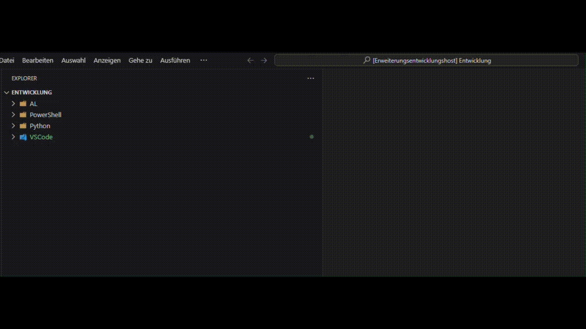

# ALdefaultProjectSettings

> A settings extension for Microsoft Dynamics 365 Business Central development. Generates a standard settings.json for AL projects

Feel free to support me here:

## ✨Start

- open vscode
- press F1
- enter MC: Go!
- settings.json will be created

## Commands

## 📕Commands

- `MC: Go! - create a new settings.json `
- `MC: Explorer Right - puts the file explorer on the right side`
- `MC: Explorer Left - puts the file explorer on the left side`
- `MC: Toggle AppSourceCop - activate or deactivate the AppSourceCop`
- `MC: Add Workspace Settings - insert settings into workspace file`
- `MC: Add Cloud Launch Settings - Adds a configuration for the SaaS environment to the launch.json`

## 🤝 Contributing

Your contributions are welcome. If you want to contribute a feature, bug fix, improvement, or something else, just create a pull request.
Feel free to check [issues page](https://github.com/mc-wusel/ALdefaultProjectSettings/issues)

Some advice before you start:

- Check the issues first. It may be that your idea, bug, or feature has already been mentioned by someone else.

- Create an issue before starting work! This is important. I may already be working on an improvement similar (or equal) to what you planned on working.

## License

This entire repository is licensed under the MIT License. [See here](LICENSE) for more infoarmations.
